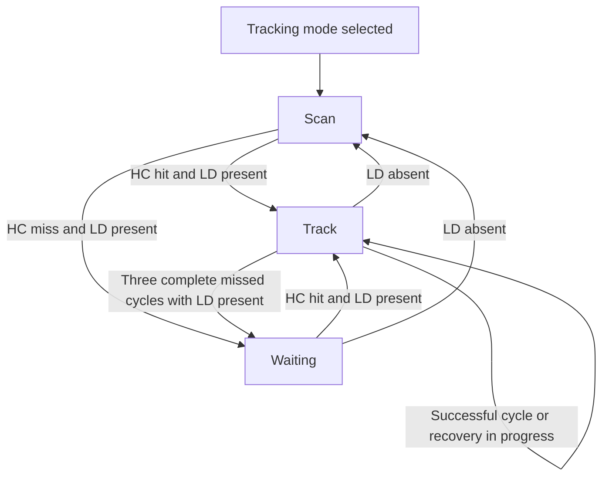

# Radar Tracking V.3

An ESP32 project that scans a 180-degree sector, detects nearby objects, and follows a confirmed target. The HC-SR04 supplies distance measurements, the HLK-LD2410S supplies a presence-confirmation signal, and an SG90 servo changes the direction of both sensors. A 128 x 64 SSD1306 OLED shows the scan as a Sector PPI display, while a buzzer indicates the detection state.

**Platform:** DOIT ESP32 DevKit V1, Arduino framework, and PlatformIO in VS Code.

See the [system flowchart](docs/Flowcharts/system.svg) and [tracking flowchart](docs/Flowcharts/tracking.svg) for a visual explanation of program operation.

## 1. Hardware roles

| Component | Role in the system |
|---|---|
| ESP32 | Reads inputs, runs the state machine, and controls all outputs. |
| HC-SR04 | Measures distance in the current direction. Its measurements guide scanning and tracking. |
| HLK-LD2410S | Provides a second confirmation through its digital OT2 output. The firmware does not read its UART distance data. |
| Push button | Switches between Search and Tracking modes using an interrupt and software debouncing. |
| SG90 servo | Rotates the HC-SR04 and LD2410S together. |
| SSD1306 OLED | Shows the mode, state, commanded angle, measured distance, and target markers. |
| Buzzer | Uses different beep patterns for scanning, detection, and Waiting. |

The system measures distance directly but uses the commanded servo angle as the target bearing. It has no position-feedback sensor to verify the actual shaft angle. Confirmation means that the ultrasonic detection and radar presence signal agree; the firmware does not identify individual objects or prove that both sensors detected the same object.

## 2. Startup and mode selection

On every power-on or reset, the firmware:

1. Configures the sensor pins, button, buzzer, servo PWM, and interrupts.
2. Selects **Search mode** and commands the servo to its home angle of **0 degrees**.
3. Initializes the OLED, trying I2C address `0x3C` and then `0x3D`.
4. Allows an initial **800 ms** servo settling period before ultrasonic measurements begin.
5. Shows `SEARCH` across the OLED for **3 seconds**, then displays the radar screen.

The splash screen does not pause sensor processing or servo control. Scanning can begin before the splash ends. If OLED initialization fails, the control loop continues without updating the screen.

Each accepted button press switches between Search and Tracking. A mode change clears old target markers, distance data, radar confirmation, and tracking recovery counters. It also restarts the three-second mode splash. Changing mode keeps the current servo angle; only startup commands the home angle.

The button is connected to ground and uses the ESP32's internal pull-up. A falling-edge ISR records a press event. The main loop checks that the input remains stable for **35 ms** before accepting it. The button must be released and debounced before another press can be accepted, so holding it down does not repeatedly change modes.

## 3. Search mode

Search provides a continuous survey of the area:

1. Wait for the servo to settle at its current angle.
2. Measure distance with the HC-SR04.
3. Treat a valid reading from **2 to 60 cm**, inclusive, as a detection.
4. Update the display and buzzer according to that measurement.
5. Advance the servo by **3 degrees**.
6. Reverse direction at the 0-degree and 180-degree endpoints and continue scanning.

A detection does **not** stop the servo in Search mode. Search reports that something is ahead and continues surveying the sector.

The firmware does not read the LD2410S input in Search mode. The sensor may remain powered, but its signal cannot trigger confirmation or Waiting. **Waiting never occurs in Search mode.**

## 4. Tracking mode

Tracking mode contains three internal states: **Scan**, **Track**, and **Waiting**. Selecting Tracking starts in Scan. The LD2410S OT2 signal must remain stable for **40 ms** before the firmware accepts a change in presence.

### 4.1 Acquiring a target

While acquiring a target, the two inputs determine the next action:

| HC-SR04 detects an object within 60 cm | LD2410S presence | Action |
|---|---|---|
| No | No | Continue scanning. |
| Yes | No | Continue scanning; ultrasonic detection alone cannot start tracking. |
| No | Yes | Enter Waiting and hold the current angle. |
| Yes | Yes | Start tracking around the angle where the object was detected. |

An initially radar-only detection enters Waiting immediately. The recovery procedure below applies only after a target has already been confirmed and tracking has started.

### 4.2 Following a confirmed target

The controller stores a **tracking center** and repeatedly measures three directions:

1. Left of the center.
2. Right of the center.
3. At the center itself.

Normally, the side measurements are taken at **center - 8 degrees** and **center + 8 degrees**. Each commanded angle is limited to the configured servo range.

At the end of a complete three-measurement cycle, the controller compares valid detections within 60 cm. It starts with the center reading, if available, and selects a side only when it is **more than 2 cm closer** than the current best reading. This margin reduces corrections caused by small distance differences.

- **If the center still detects the object:** move the tracking center toward the selected side by at most **6 degrees per cycle**.
- **If the center misses but a side detects the object:** move the tracking center directly to that measured side angle.
- **If no direction detects the object:** start the recovery procedure instead of stopping immediately.

The servo then begins another left-right-center cycle around the updated center. This is a directional probing method: it chooses a direction from measured echoes rather than receiving an object angle from the radar module.

### 4.3 Recovering after missed echoes

A brief loss of echoes should not immediately freeze the servo. While LD2410S presence remains confirmed, the controller expands its search around the last tracking center:

| Consecutive complete cycles with no detection | Next action |
|---|---|
| First missed cycle at +/-8 degrees | Try another cycle at +/-16 degrees. |
| Second missed cycle at +/-16 degrees | Try another cycle at +/-24 degrees. |
| Third missed cycle at +/-24 degrees | Enter Waiting at the last tracking center. |

If any direction in a completed cycle detects the object, the missed-cycle counter resets and normal probing returns to +/-8 degrees. A single missed side measurement does not count as a completely missed cycle.

Recovery is limited by **measurement cycles**, not by a fixed delay in seconds. Its duration depends on servo travel, settling time, echo timing, and display updates. During recovery, the controller remains in Track and keeps the detection beep pattern.

If the debounced LD2410S presence signal becomes inactive, the controller leaves Track or Waiting and returns to Scan without waiting for three missed cycles.

### 4.4 Waiting

Waiting holds the servo at one angle while continuing to read the sensors and button:

- LD2410S still detects presence, but HC-SR04 does not detect an object within 60 cm: remain in Waiting.
- HC-SR04 detects an object while LD2410S still confirms presence: resume tracking.
- LD2410S no longer confirms presence: return to Scan.
- The button is pressed: switch to Search mode.

**Waiting has no timeout.** It does not automatically resume scanning after ten seconds. Any delay already present in the sensor's OT2 output affects when the firmware sees presence disappear.

The following diagram describes the internal states of Tracking mode. The mode button can leave any of these states and select Search.



## 5. Distance measurement and servo timing

The ESP32 sends a **12 microsecond** trigger pulse to the HC-SR04. An interrupt on the ECHO pin records the rising and falling edges, allowing the main loop to continue while the echo is being measured.

The firmware calculates distance using:

```text
distance_cm = echo_pulse_width_us / 58.0
```

A measurement times out after **25 ms**. Missing, zero-width, or late echoes are rejected. An ECHO input that is already high before a new trigger is also treated as an invalid measurement. Finite distances from **2 to 400 cm** are accepted for display, but only **2 to 60 cm** count as a target detection. Invalid readings are represented internally as `NAN`, not as a zero-distance object.

New trigger pulses are spaced at least **65 ms** apart. After a servo command changes, the firmware also waits:

```text
settling_time_ms = 55 + 5 * absolute_angle_change_degrees
```

For example, a 3-degree movement requires a 70 ms settling interval. This is a software allowance for movement, not feedback proving the servo has reached the angle.

Servo PWM uses **50 Hz**, with a configured pulse range of **500 to 2400 microseconds** for logical angles 0 to 180. These endpoints are calibration values and must suit the actual servo and mounting. The buzzer's PWM channel uses a separate timer when a passive buzzer is selected.

Each ultrasonic sample retains the angle at which it was measured. A servo change cancels an active ping, and a sample is accepted only if its measurement angle still matches the commanded servo angle. This avoids assigning an old echo to a new direction.

## 6. OLED Sector PPI display

The 128 x 64 screen is divided into three areas:

| Area | Information |
|---|---|
| Top row | `SEARCH` or `TRACK`, followed by `SCAN`, `FOUND`, `LOCK`, or `WAIT`. |
| Middle | A 180-degree sector with 20, 40, and 60 cm range rings, a sweep line, and detection markers. |
| Bottom row | `A:xxx` for the commanded servo angle and `D:xxcm` for the latest valid ultrasonic distance. |

On the display, **0 degrees is right, 90 degrees is up, and 180 degrees is left**. The physical direction depends on how the servo and sensor bracket are mounted.

For a plotted detection, distance and angle are converted to pixels around `(64, 53)` with an outer radius of 42 pixels:

```text
radius_px = distance_cm * 42 / 60
x = 64 + round(radius_px * cos(angle_radians))
y = 53 - round(radius_px * sin(angle_radians))
```

### Search markers

A detected object appears as a solid **3 x 3 pixel** point for the first **450 ms**, then as a **single pixel** until it reaches **1800 ms** of age. The display stores up to 32 detections in a circular history buffer. A new measurement at an already recorded angle replaces its old result; a miss at that angle removes the old point immediately.

These points represent recent measurements, not a guarantee that the object is still there. `FOUND` follows the latest ultrasonic result, so old points can remain visible while the status has returned to `SCAN`.

### Tracking markers

A confirmed tracking measurement appears as a **5 x 5 pixel outline with a center point**. It stays at its measured angle and distance while the servo probes other directions. The last confirmed marker may remain visible for up to **1200 ms** through brief misses.

Entering Waiting or losing LD2410S confirmation hides the tracking marker immediately. During recovery, `LOCK` may remain on screen after the marker expires because the controller is still attempting to reacquire the object.

Waiting displays `D:--cm`. Other invalid measurements also show `D:--cm`. Valid readings beyond 60 cm may appear in the distance text, but they do not create target points on the sector.

Display updates are scheduled approximately every **150 ms** and are deferred while an ultrasonic ping is active. An OLED transfer itself is synchronous; it is not started during an active echo measurement.

## 7. Buzzer patterns

| Condition | Pattern |
|---|---|
| Search without a current detection, or Tracking mode in Scan | One 80 ms beep every 1 second. |
| Search with a current detection, or active Track including recovery | One 80 ms beep every 0.5 seconds. |
| Waiting | Two 80 ms beeps per 1-second cycle; the second starts 180 ms after the first. |

Buzzer timing is updated from elapsed time, so generating a beep does not block sensor processing. The default build drives an active buzzer through a transistor. The passive-buzzer build produces a **2200 Hz** tone during each beep.

## 8. Program execution

Each pass through `loop()` performs these tasks in order:

1. Process the button event and debounce the input.
2. Read and debounce LD2410S presence, unless Search is active.
3. Complete an ultrasonic measurement or start one when timing permits.
4. Apply any new servo angle requested by the controller.
5. Update the buzzer output.
6. Update the OLED when no ping is active.
7. Yield for 1 ms when no ping is active.

The button and ECHO ISRs only capture events and timing information. They do not draw on the OLED, control the servo, or run the tracking algorithm. Shared interrupt data is protected by critical sections. Most scheduling uses elapsed `millis()` or `micros()` comparisons rather than long delays; the trigger pulse and OLED transfers are the brief synchronous operations.

## 9. Wiring

| Component | Signal connections | Power |
|---|---|---|
| HC-SR04 | TRIG: GPIO18; ECHO: GPIO19 through a voltage divider | 5V |
| HLK-LD2410S | OT2: GPIO27 | 3V3 |
| Push button | GPIO33 to GND; internal pull-up enabled | No separate supply |
| SG90 | Signal: GPIO25 | 5V |
| Buzzer driver | GPIO26 to the transistor driver input | Match the buzzer rating |
| SSD1306 | SDA: GPIO21; SCL: GPIO22 | 3V3 |

All devices must share GND. For the HC-SR04 ECHO divider, connect **1 kohm from ECHO to GPIO19** and **2 kohms from GPIO19 to GND**. Two 1 kohm resistors in series can provide the 2 kohm lower resistor. Do not connect the 5V ECHO output directly to the ESP32 input.

Keep the sensor faces unobstructed and route the wires so they do not tighten or collide throughout the scan. Changing the physical scanning sector requires repositioning the sensor bracket or servo mounting; the software angle represents the configured shaft movement range. Ensure the supply can support the servo load.

## 10. Build and upload

Open the **`Project Radar Tracking V.3` folder directly** in VS Code so PlatformIO uses this project's configuration.

For an active buzzer:

```bash
pio run -e esp32doit-devkit-v1
pio run -e esp32doit-devkit-v1 -t upload
```

For a passive buzzer:

```bash
pio run -e passive-buzzer
pio run -e passive-buzzer -t upload
```

The submission build has no application Serial debug output. A quiet Serial Monitor is therefore expected during normal operation. Diagnostic-only and servo-alignment programs are not included in V.3.

## 11. Source files and configuration

| File | Responsibility |
|---|---|
| `src/main.cpp` | Hardware initialization, interrupts, sensor timing, servo commands, buzzer output, and display scheduling. |
| `include/Config.h` | Pin assignments, detection thresholds, servo calibration, and timing constants. |
| `include/RadarController.h` | Button debouncing and the Search/Tracking/Waiting decision logic. |
| `include/RadarScope.h` | Detection history, polar-to-screen conversion, and Sector PPI drawing. |
| `platformio.ini` | Board, framework, library versions, and buzzer build environments. |

The main settings are centralized in `Config.h`:

| Setting | Default | Meaning |
|---|---|---|
| `DETECT_CM` | 60 cm | Maximum distance for a target detection. |
| `SCAN_STEP_DEG` | 3 degrees | Angle increment during scanning. |
| `TRACK_PROBE_DEG` | 8 degrees | Normal offset of left and right tracking samples. |
| `TRACK_STEP_DEG` | 6 degrees | Maximum center correction when the center still detects the object. |
| `TRACK_LOST_PROBE_CYCLES` | 3 | Consecutive complete missed cycles required before Waiting. |
| `TRACK_RECOVERY_EXPAND_DEG` | 8 degrees | Additional probe offset after each complete miss. |
| `TRACK_RECOVERY_MAX_DEG` | 24 degrees | Maximum recovery probe offset. |
| `TRACK_IMPROVEMENT_CM` | 2 cm | Distance advantage required to select another probe direction. |
| `SERVO_MIN_US` / `SERVO_MAX_US` | 500 / 2400 microseconds | Servo pulse endpoints. |
| `SEARCH_ECHO_FRESH_MS` / `SEARCH_ECHO_TTL_MS` | 450 / 1800 ms | Search marker size transition and expiration. |

The project is intended for one-target following within a limited sector. Performance depends on the object, echo quality, sensor alignment, servo response, and power supply. Software state-machine tests do not replace checking the assembled hardware with both stationary and moving targets.
